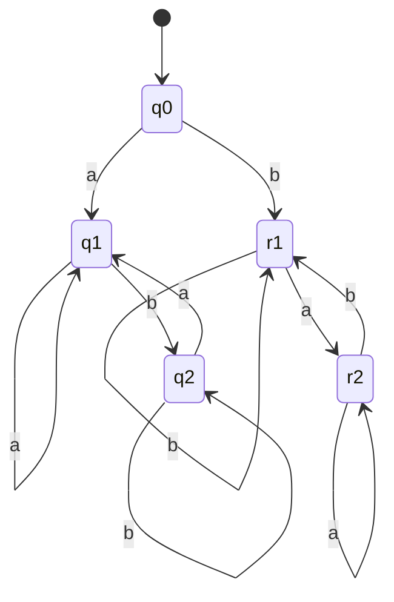
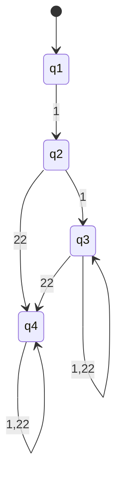
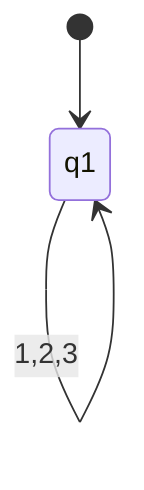
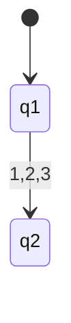
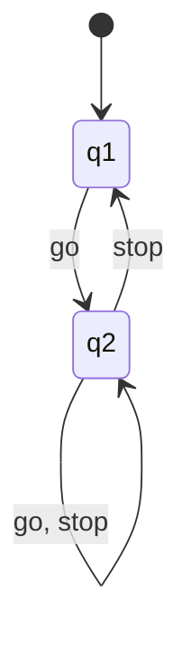

![[Pasted image 20250224175611.png]]

1. aaabba, aaaab, aabb, bbabba, bbaab, bbbb, bbbabba, bbbaab, bbbbb
2. aa,bb, bbb, abba, aab, bb
3. bb
4. abba, aab, bb, abbaaab, aabbb ...

![[Pasted image 20250224180601.png]]

1. 
a) q1 -> q2 -> q3 -> q3 -> q3 -> q3
b) q1 -> q2 ->  q3 -> q3 -> q3 -> q3 -> q3
c) q1 -> q2 -> q3 -> q3
d) q1

2. 
in m1: none
in m2: d
in m3:  d

3.  
$$L(M_1)=\{ b^na|n\ge0 \}$$
$$L(M_2)=\{ b|n\ge0 \}$$
$$L(M_3)=\{ b^n a^m|m\in\{0,1\}|n\ge0 \}$$

![[Pasted image 20250224182541.png]]

$$L(M_4)=\{xwx|x\inΣ|w\inΣ^*\}\cup\{a,b\}$$
r1 and q1 should be green

![[Pasted image 20250224182643.png]]
1. 

2. 

3. 

4. 
